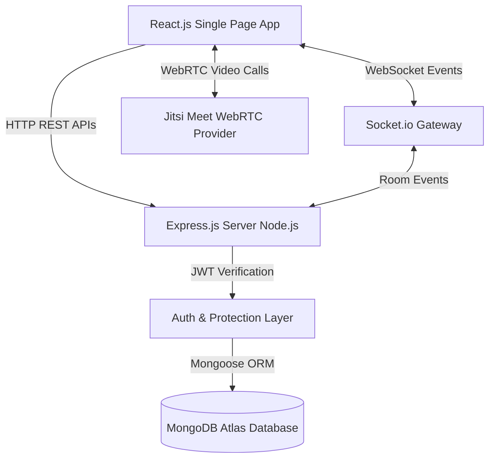
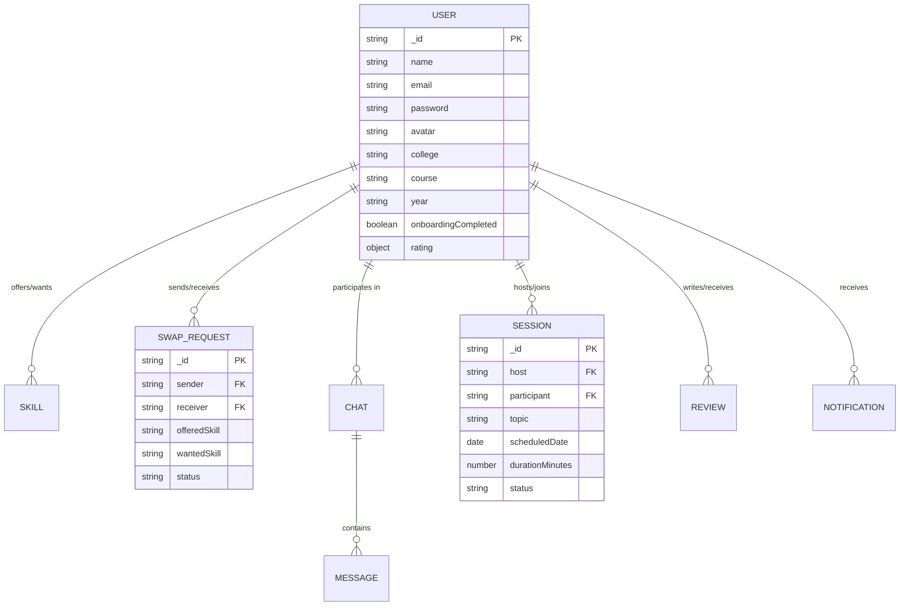

# SkillSphere: Complete MERN Skill Exchange Platform 🔮

[-blueviolet?style=for-the-badge)](https://github.com/)
[](https://socket.io/)
[](https://meet.jit.si)
[](https://jwt.io/)

SkillSphere is a full-stack **MERN (MongoDB, Express.js, React.js, Node.js)** peer-to-peer skill exchange platform. It enables students, self-taught programmers, and creators to engage in **barter-based collaborative learning**—swapping knowledge without monetary transactions.

---

## 🌟 Comprehensive Features

1. **User Authentication & Authorization**:
   - Secure Registration, Login, and persistent JWT sessions.
   - Password hashing using `bcryptjs` with 10 salt rounds.
   - Protected route middleware guarding all private application endpoints.

2. **User Profile & Photo Management**:
   - Academic details (College, Course, Year, Bio, Location).
   - Base64 avatar upload with client-side canvas compression/resizing, instant preview, change image, and remove image options.
   - Social & portfolio links (GitHub, LinkedIn, Twitter, Portfolio).

3. **3-Step Interactive Onboarding**:
   - Step 1: Academic details (College, Course, Year, Bio).
   - Step 2: Skills I Can Teach (category & expertise level).
   - Step 3: Skills I Want to Learn.
   - Auto-guides new users to `/onboarding` before accessing the platform.

4. **Algorithmic Smart Matching System**:
   - Dynamic compatibility calculation based on mutual barter compatibility (A teaches what B wants, B teaches what A wants).
   - Weighted score bonuses for overlapping college/course backgrounds.
   - Generates deterministic compatibility percentages (e.g. 95%, 70%, 45%).

5. **Skill Swap Request Workflow**:
   - Propose skill swap with custom notes and selected offered/wanted skills.
   - Incoming & Outgoing proposal tracking (`pending`, `accepted`, `rejected`, `cancelled`).
   - Automatically establishes peer connection and opens a chat room upon acceptance.

6. **Peer Connections Hub**:
   - Dedicated `/api/connections` API and Connections page.
   - View active peer connections, mutual skills, chat history, and quick schedule call triggers.

7. **Real-Time Messenger (Socket.io)**:
   - 1-on-1 instant messaging with message history stored in MongoDB.
   - Live typing indicators (`typing_start`, `typing_stop`).
   - Real-time online/offline presence tracking.

8. **Dedicated Online Browser Video Classroom**:
   - Dedicated `/session/:sessionId` page with WebRTC / Jitsi Meet browser embed.
   - Zero installation required — works directly in desktop and mobile browsers.
   - Includes live countdown timer, participant roles (Mentor/Learner), status update buttons (`Mark Completed`, `Cancel`).

9. **Peer Reviews & Rating System**:
   - 1-to-5 star ratings with written testimonials.
   - Automatically computes and updates cumulative peer trust scores on user profiles.

10. **Real-Time Alerts & Notifications**:
    - In-app notification bell with unread counters.
    - Triggers notifications for new swap proposals, acceptances, chat messages, scheduled sessions, and reviews.

11. **Responsive Glassmorphism UI & Dark Mode**:
    - Mobile-first responsive design supporting 360px, 390px, 430px, 768px, 1024px, 1440px viewport widths.
    - Seamless Light / Dark theme toggle.

---

## 🏗️ System Architecture & Data Flow



---

## 🗄️ Database Entity-Relationship (ER) Diagram



---

## 🛠️ Technology Stack Breakdown

| Layer | Technologies Used |
| :--- | :--- |
| **Frontend** | React 19, Vite, React Router DOM v7, Axios, Lucide Icons, Glassmorphism CSS |
| **Backend** | Node.js, Express.js (REST API Layer), Socket.io (WebSocket Protocol) |
| **Video/Audio** | Jitsi Meet WebRTC API (Browser-native, zero installation) |
| **Database** | MongoDB, Mongoose ORM |
| **Authentication** | JSON Web Tokens (`jsonwebtoken`), Password Hashing (`bcryptjs`), CORS |

---

## 📡 Complete API Documentation

### Authentication (`/api/auth`)
- `POST /api/auth/register` — Register new user.
- `POST /api/auth/login` — Login user & receive JWT token.
- `GET /api/auth/me` — Get current logged-in user profile.
- `POST /api/auth/onboarding` — Complete 3-step onboarding profile.

### User Profiles (`/api/users`)
- `GET /api/users` — Search/filter users by name, college, or skill.
- `GET /api/users/:id` — Get public user profile by ID.
- `PUT /api/users/profile` — Update user profile & avatar image.

### Skill Recommendations (`/api/matches`)
- `GET /api/matches` — Get algorithmic compatibility matches.

### Skill Swap Proposals (`/api/requests`)
- `POST /api/requests` — Send a new skill swap request.
- `GET /api/requests` — Get incoming & outgoing swap requests.
- `PUT /api/requests/:id` — Accept or decline swap request.

### Peer Connections (`/api/connections`)
- `GET /api/connections` — Get active peer connections with last message & chat IDs.

### Real-Time Messenger (`/api/chats`)
- `GET /api/chats` — Get active chat conversations.
- `GET /api/chats/:chatId/messages` — Fetch message stream for a chat.
- `POST /api/chats/:chatId/messages` — Send a message in a chat.

### Learning Sessions & Video Calls (`/api/sessions`)
- `POST /api/sessions` — Schedule a new 1-on-1 video learning session.
- `GET /api/sessions` — Fetch user's upcoming and completed sessions.
- `GET /api/sessions/:id` — Get detailed session metadata & WebRTC room link.
- `PUT /api/sessions/:id` — Update session status (`completed`, `cancelled`).

### Reviews & Ratings (`/api/reviews`)
- `POST /api/reviews` — Write a peer review after completed session.
- `GET /api/reviews/:userId` — Fetch reviews for a specific user.

### Notifications (`/api/notifications`)
- `GET /api/notifications` — Get user notifications & unread count.
- `PUT /api/notifications/all/read` — Mark all notifications as read.

---

## 📱 Testing SkillSphere from Phone on Local Network (LAN)

SkillSphere is configured out of the box for testing from your mobile phone on the same Wi-Fi network:

1. **Find your PC LAN IP Address**:
   - Open Command Prompt or PowerShell on Windows and run:
     ```cmd
     ipconfig
     ```
   - Look for **IPv4 Address** (e.g. `192.168.1.15` or `192.168.29.100`).

2. **Start Backend & Frontend**:
   - Backend listens on `0.0.0.0:5000`
   - Frontend Vite listens on `0.0.0.0:5173` (`server: { host: true }`)

3. **Open from Mobile Browser**:
   - On your phone (connected to same Wi-Fi), open browser and navigate to:
     ```text
     http://<YOUR-PC-IP>:5173
     ```
   - Example: `http://192.168.1.15:5173`
   - The frontend automatically detects the network host and connects API calls & Socket.io to `http://<YOUR-PC-IP>:5000`.

---

## 🧪 Postman Collection API Testing

A complete Postman collection is included in the project root: `SkillSphere.postman_collection.json`.

1. Open Postman -> Click **Import** -> Select `SkillSphere.postman_collection.json`.
2. Configure Collection Variables:
   - `baseUrl`: `http://localhost:5000/api`
   - `token`: Set to your JWT token after calling **Login User** or **Register User**.
3. All requests are grouped by module with sample JSON request bodies.

---

## ⚡ Local Development Setup

1. **Clone & Install Dependencies**:
   ```bash
   # Server Setup
   cd server
   npm install

   # Client Setup
   cd ../client
   npm install
   ```

2. **Environment Variables**:
   - Server (`server/.env`):
     ```env
     PORT=5000
     MONGO_URI=mongodb://localhost:27017/skillsphere
     JWT_SECRET=skillsphere_super_secret_jwt_key_2026_final_year_project
     CLIENT_URL=http://localhost:5173
     NODE_ENV=development
     ```
   - Client (`client/.env`):
     ```env
     VITE_API_URL=http://localhost:5000/api
     VITE_SOCKET_URL=http://localhost:5000
     ```

3. **Run Application**:
   - Start Backend: `cd server && npm run dev`
   - Start Frontend: `cd client && npm run dev`
   - Access App: `http://localhost:5173`

---

## 🚀 Deployment Instructions

### Frontend (Vercel)
1. Push `client` code to GitHub.
2. Import project in Vercel. Set Root Directory to `client`.
3. Set Environment Variable in Vercel:
   - `VITE_API_URL` = `https://your-backend.onrender.com/api`
   - `VITE_SOCKET_URL` = `https://your-backend.onrender.com`
4. Deploy.

### Backend (Render / Railway)
1. Import `server` code to Render/Railway.
2. Build Command: `npm install`
3. Start Command: `node server.js`
4. Set Environment Variables:
   - `MONGO_URI` = MongoDB Atlas Connection String
   - `JWT_SECRET` = Secure Random String
   - `CLIENT_URL` = Vercel Frontend URL

### Database (MongoDB Atlas)
1. Create a Cluster on MongoDB Atlas.
2. Allow IP `0.0.0.0/0` in Network Access.
3. Copy Connection String and paste into `MONGO_URI` in backend environment variables.
